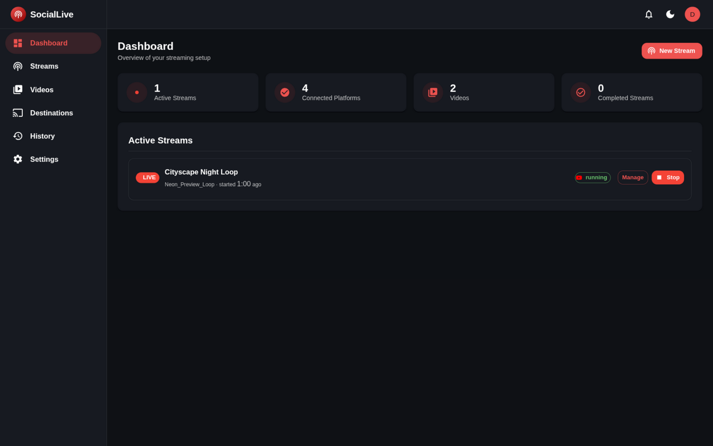
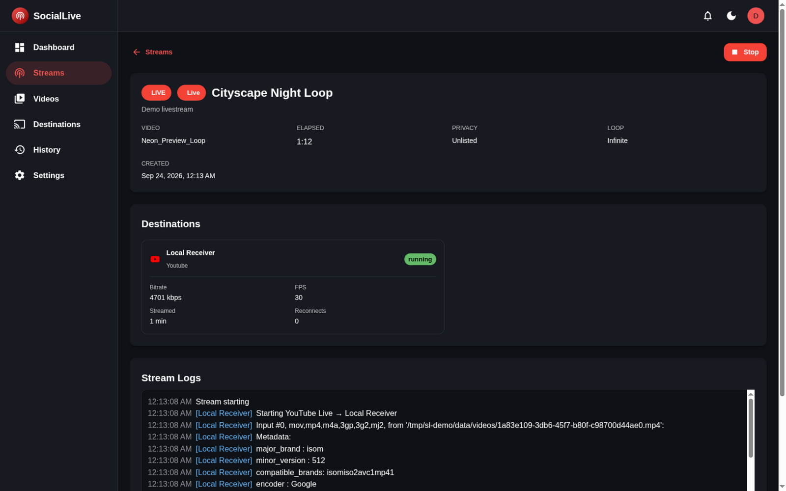
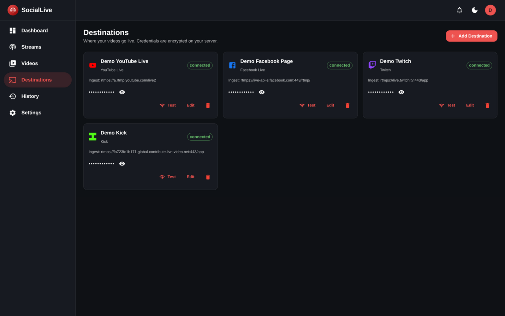
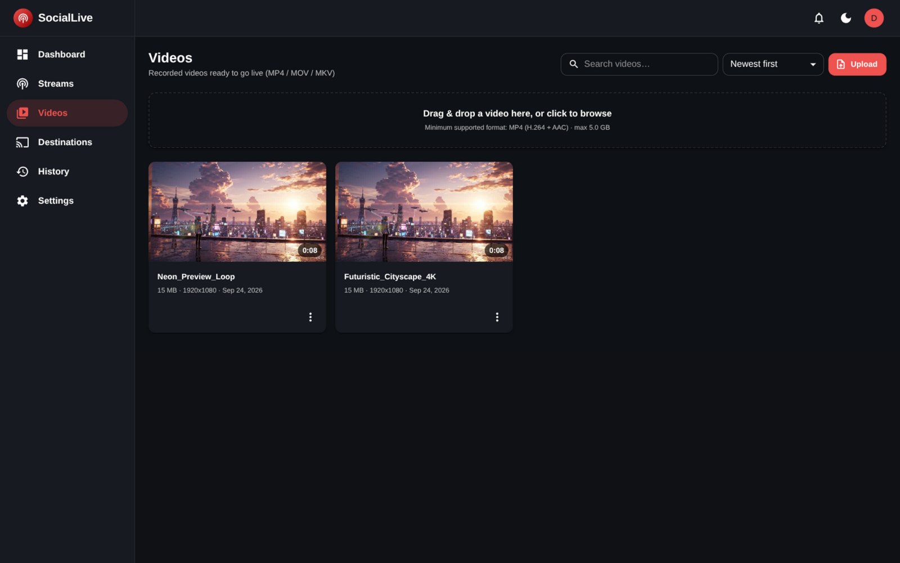

# SocialLive

**Open-source, self-hosted, cross-platform live streaming control platform.**

> **[AxionAura](https://github.com/AxionAura)** · Open source by default. Free for everyone.

[](https://github.com/AxionAura/social-live/actions/workflows/ci.yml)

## 📸 Screenshots

| | |
|---|---|
|  |  |
|  |  |

**Dashboard** · live stream monitoring · multi-platform destinations (YouTube, Facebook, Twitch, Kick) · video library — light mode included, see [`docs/screenshots/`](docs/screenshots).

Broadcast recorded videos to **YouTube Live**, **Facebook Live**, **Twitch**, and **Kick** from a browser-based dashboard — while keeping your data, credentials, videos, and streaming infrastructure under your own control.

No mandatory cloud services. No external SaaS accounts. Runs on Linux, Windows, macOS, Android/Termux, Docker, VPS, or your laptop.

---

## ✨ Features

| Feature | Status |
|---------|--------|
| 🎬 **Recorded video streaming** | ✅ MP4 / MOV / MKV |
| 🌐 **YouTube Live** | ✅ RTMPS (stream key) |
| 🌐 **Facebook Live** | ✅ RTMPS (stream key) |
| 🟣 **Twitch** | ✅ RTMPS (stream key) |
| 🟢 **Kick** | ✅ RTMPS (stream key) |
| 🖥 **Browser dashboard** | ✅ Material UI, light/dark, responsive |
| 🔐 **Local auth** | ✅ First-run admin setup, sessions |
| 🔒 **Encrypted credentials** | ✅ AES-256-GCM at rest |
| 🛡 **SSRF protection** | ✅ Private IP/host blocking |
| 🔁 **Auto-reconnect** | ✅ Exponential backoff |
| ⏱ **Scheduled streams** | ✅ Background scheduler |
| ♾ **Loop modes** | ✅ None / N× / Infinite |
| 📊 **Live metrics** | ✅ FPS, bitrate, duration |
| 📜 **Stream logs** | ✅ Per-destination, redacted |
| 📁 **Video library** | ✅ Upload, search, rename, delete |
| 🩺 **Diagnostics** | ✅ `social-live doctor` |
| 📦 **Docker** | ✅ Official image + compose |
| 🤖 **Termux/Android** | ✅ Supported |

---

## 🚀 Quick Start

### Option 1: One-line installer (recommended — Linux / macOS / Termux)

```bash
curl -fsSL https://raw.githubusercontent.com/AxionAura/social-live/main/install.sh | bash
```

The script installs Node.js and FFmpeg if they're missing, downloads and builds
SocialLive into `~/.social-live`, registers a background service (systemd user
unit on Linux, launchd on macOS), and prints the dashboard URL. Later:
`social-live update` to upgrade, `social-live doctor` to diagnose,
`install.sh --uninstall` to remove. Review the script before running — it's
part of the repo.

### Option 2: Docker (recommended for VPS)

```bash
# 1. Clone and configure
git clone https://github.com/AxionAura/social-live.git
cd social-live
cp .env.example .env
# Edit .env (SESSION_SECRET, ENCRYPTION_KEY, etc.)

# 2. Build and start
docker compose -f docker/docker-compose.yml up -d

# 3. Open http://your-server:3000
#    First run → create admin account → add YouTube/Facebook → upload video → Go live!
```

### Option 3: Native (Linux / macOS / Windows)

```bash
# Prerequisites: Node.js 22.13+, FFmpeg
git clone https://github.com/AxionAura/social-live.git
cd social-live
npm ci
npm run build

# First run: interactive setup
npm run cli setup
# Or run server directly:
npm start

# Open http://localhost:3000
```

### Option 4: Termux (Android — or use the one-line installer)

```bash
pkg install nodejs ffmpeg git
git clone https://github.com/AxionAura/social-live.git
cd social-live
npm ci
npm run build
npm run cli setup
npm start
# Open http://localhost:3000 in your phone browser
```

---

## ⚙️ Configuration

Copy `.env.example` to `.env` and adjust:

| Variable | Default | Description |
|----------|---------|-------------|
| `APP_HOST` | `0.0.0.0` | Bind address |
| `APP_PORT` | `3000` | HTTP port |
| `DATA_DIR` | `./data` | Root for DB, videos, logs, keys |
| `DATABASE_URL` | `sqlite:./data/database/app.db` | SQLite path (or `postgresql://...` — future) |
| `FFMPEG_PATH` | `ffmpeg` (PATH) | Override FFmpeg binary |
| `FFPROBE_PATH` | `ffprobe` (PATH) | Override FFprobe binary |
| `SESSION_SECRET` | *auto-generated* | Cookie signing secret |
| `ENCRYPTION_KEY` | *auto-generated* | **Back this up!** Credentials unrecoverable without it |
| `MAX_UPLOAD_SIZE` | `5GB` | Max video upload size (bytes) |
| `MAX_CONCURRENT_STREAMS` | `4` | Simultaneous streams limit |
| `VIDEO_BITRATE_KBPS` | `4500` | Encoding video bitrate |
| `AUDIO_BITRATE_KBPS` | `128` | Encoding audio bitrate |
| `FFMPEG_PRESET` | `veryfast` | x264 preset (use `superfast` on weak devices) |
| `VIDEO_FPS` | `30` | Output frame rate — Kick requires 30/60 |
| `ALLOW_PRIVATE_RTMP_TARGETS` | `false` | **Dev only** — allows `rtmp://127.0.0.1/...` |
| `LOG_LEVEL` | `info` | `debug` / `info` / `warn` / `error` |

---

## 🔑 Platform Setup

### YouTube Live
1. Open **YouTube Studio → Create → Go live**
2. Choose **Streaming software** (not webcam)
3. Copy **Stream key**
4. In SocialLive: **Destinations → Add → YouTube** → paste key

### Facebook Live
1. Open **Live Producer** (facebook.com/live/production)
2. Choose **Streaming software**
3. Copy **Stream key**
4. In SocialLive: **Destinations → Add → Facebook** → paste key

### Twitch
1. Open the [Twitch Creator Dashboard](https://dashboard.twitch.tv) → **Settings → Stream**
2. Copy the **Primary Stream Key** (2FA required on your Twitch account)
3. In SocialLive: **Destinations → Add → Twitch** → paste key

### Kick
1. Open [creator.kick.com](https://creator.kick.com) → **Settings → Stream Key**
2. Copy the **Stream Key**
3. In SocialLive: **Destinations → Add → Kick** → paste key

> **Note:** Stream keys are encrypted on your server and never logged or exposed to the browser.

---

## 🖥 Dashboard Overview

| Page | Purpose |
|------|---------|
| **Dashboard** | Stats + active streams (manage/stop) |
| **Streams** | List, filter, create, view details |
| **New Stream** | 5-step wizard (video → destinations → config → review → start) |
| **Videos** | Upload, search, rename, delete, thumbnails |
| **Destinations** | Add/remove YouTube/Facebook, test connectivity |
| **History** | Completed/failed streams with filters |
| **Settings** | Password, system info, diagnostics, audit log |

---

## 📖 Documentation

| Guide | Link |
|-------|------|
| Installation (Linux / Windows / macOS / Termux / Docker / VPS) | `docs/installation.md` |
| Configuration reference | `docs/configuration.md` |
| YouTube setup walkthrough | `docs/platform-youtube.md` |
| Twitch setup walkthrough | `docs/platform-twitch.md` |
| Kick setup walkthrough | `docs/platform-kick.md` |
| Facebook setup walkthrough | `docs/platform-facebook.md` |
| Usage: upload → stream → schedule → history | `docs/usage.md` |
| Troubleshooting (FFmpeg, ports, permissions, connections) | `docs/troubleshooting.md` |
| Security model (encryption, SSRF, hardening) | `docs/security.md` |
| Developer guide (architecture, API, contributing) | `docs/developer.md` |

---

## 🛡 Security

- **No cloud dependency** — everything runs on your infrastructure
- **Credentials encrypted at rest** — AES-256-GCM with a master key you control
- **Stream keys masked** — never in logs, browser storage, or API responses
- **SSRF protection** — private IPs, loopback, internal hostnames blocked by default
- **Command injection safe** — FFmpeg arguments via `spawn` array, never shell
- **Rate limiting** — on auth, stream start/stop, destination endpoints
- **Secure cookies** — HttpOnly, SameSite, signed, HTTPS in production
- **Audit log** — security-relevant events recorded

See `docs/security.md` for the full threat model and hardening checklist.

---

## 🧪 Testing

```bash
npm test          # Unit + integration tests
npm run typecheck # TypeScript strict check
```

---

## 🤝 Contributing

1. Fork the repo
2. Create a feature branch
3. Write tests for new behavior
4. Ensure `npm test` and `npm run typecheck` pass
5. Open a PR with a clear description

See `CONTRIBUTING.md` and `docs/developer.md` for details.

---

## 📄 License

[AGPL-3.0-or-later](LICENSE) — free for everyone to use, study, modify, and self-host.

Copyleft, on purpose: if you modify SocialLive and offer it as a hosted service, you must share your modified source code. That keeps every fork as open as the original — no one gets locked out. Regular self-hosting (personal or commercial) requires nothing from you.

---

## 🗺 Roadmap

| Version | Planned |
|---------|---------|
| **V1.1** | Better scheduler, notifications, stream thumbnails, richer metrics |
| **V2** | Twitch, TikTok, additional platform APIs |
| **V3** | Webcam, screen capture, scenes, overlays, watermarks, audio mixer |
| **V4** | Multi-user, RBAC, team workspaces, remote workers, distributed streaming |

---

## 💬 Community

- Issues & feature requests: GitHub Issues
- Discussions: GitHub Discussions
- Security reports: `SECURITY.md`

---

**Made for streamers who want full control.** 🎙️🚀

---

<p align="center">
  <b>AxionAura</b> — Open source by default. Free for everyone.<br/>
  <a href="https://axionaura.blogspot.com">Blog</a> · <a href="https://github.com/AxionAura">GitHub</a> · <a href="https://github.com/AxionAura/social-live/issues">Issues</a>
</p>